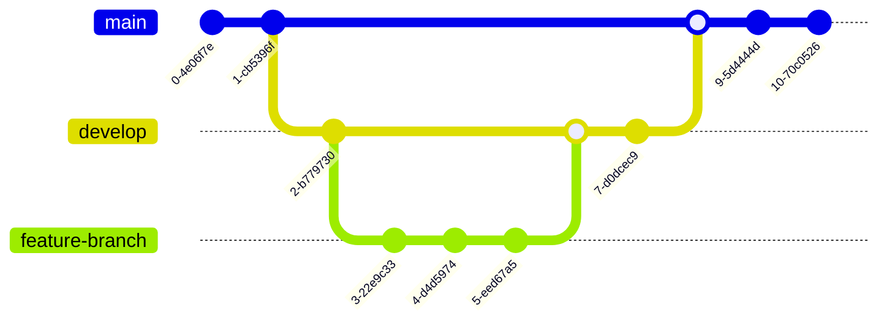

# Diagrams

## Flowchart

Reference: [CalcsBasics_flowchart4.png (1081×580)](https://help.tableau.com/current/pro/desktop/en-us/Img/CalcsBasics_flowchart4.png)

## Sequence Diagram

## Gantt Diagram

## Class Diagram

## State Diagramm

## Pie Chart

## Git Graph

## ER Diagram

## User Journey Diagram

